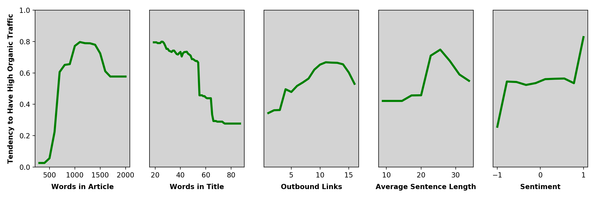

This project combined traffic and content data from a small science news website to explore the question: what characteristics of articles predict those articles receiving above average organic traffic?

To that end, traffic data was exported from Google Analytics and content data from the website's MySQL database. The data was used to train a random forest model predicting the probability of an article being among the top half of articles in terms of number of unique organic visitors for 2020 year-to-date. Five features of articles were considered as possible predictors of organic traffic:

- Article length in words
- Title length in words
- Number of outbound links in article
- Average sentence length (since writing about scientific topics can vary greatly in complexity)
- Positive or negative sentiment

Once the model was trained, it was used to predict the tendency of an article to receive above-average organic traffic given every possible feature value along a reasonable range, in combination with all possible values of other features. For example, the model was used to predict traffic for articles consisting of 300, 400, 500 ... 2,000 words in combination with every possible title length, average sentence lenth, and so on. Predictions were then averaged across every combination of other features to predict an average tendency for articles with a certain feature (e.g., articles having 300 words) to appear in the top half of articles in terms of organic traffic (in other words, to create a marginal probability). That process led to the following results:

So what are the **practical takeaways** from these results?

First, *longer articles* receive more organic traffic, and articles that contain at least 700 words are far more likely to perform above average. After a certain point, however, increasing article length does not increase the tendency to receive more organic traffic, and there appears to even be a slight drop in performance around 1,500 words. Investing resources on extremely long articles, then, does not appear to yield any additional benefits in terms of organic traffic. (Note that these results are specific to the content on the website in question and don't necessarily generalize to other websites.)

On the other hand, *more concise titles* appear to be preferable, with predicted organic traffic steadily declining as title length increases. Overall, articles with *more outbound links* also tend to perform better. Since this is a science website, that generally means articles should be sure to cite an adequate number of sources. 

There isn't such a clear pattern in terms of the effect of *average sentence length* on organic traffic although articles with medium-to-high average sentence length appear to have a slight advantage. Finally, sentiment mostly isn't associated with organic traffic, with the exception that *articles using extremely positive language tend to perform well and articles using extremely negative language tend to perform poorly.*

Overall, these results suggest an **ideal profile** of articles that are more likely to receive above-average traffic: 1,000-1,400 words, concise titles, plenty of links to external sources, moderate sentence complexity, and neutral to positive language.  

